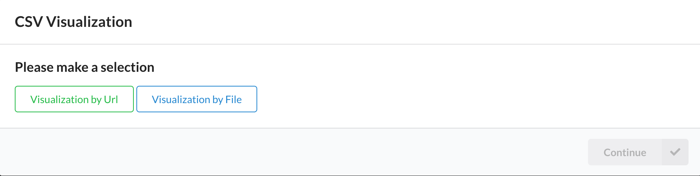
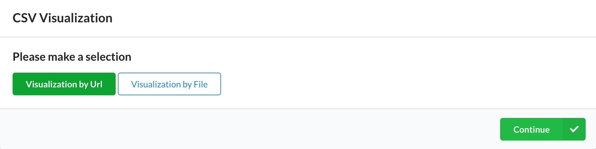
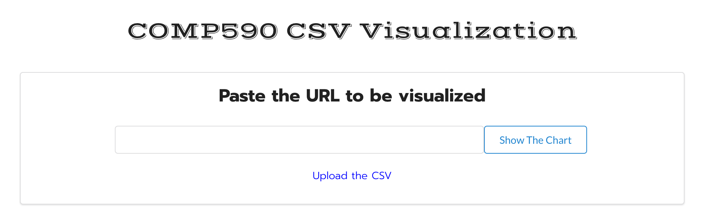
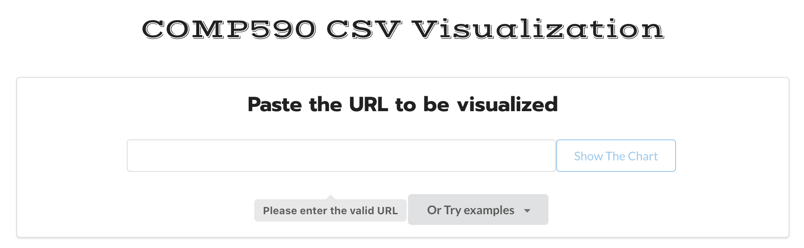
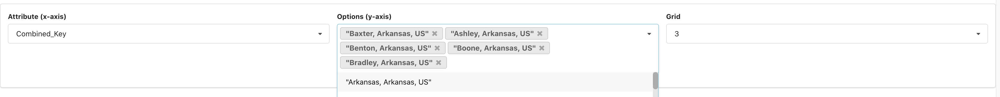
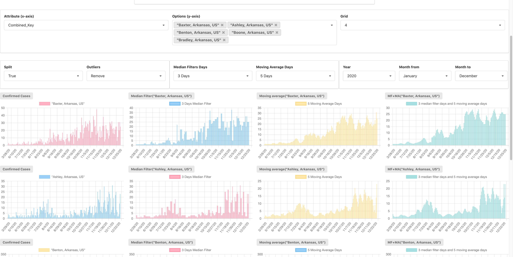

# COMP590 CSV Visualization

This CSV Visualization project provides users with two visualization options to visualize COVID-19-related data through urls or files. After successfully loading the CSV data, the user can select a certain attribute to be visualized, and select multiple values corresponding to this attribute as the main of each visualization table. The y-axis of the chart is the main content of this CSV, such as confimed case data or vaccination data. The x-axis is the time period.

In addition, our visualization project provides a lot of personalization settings for better user interaction. Users can adjust the size of the grid to layout and select time periods for data visualization according to their own preferences. For the data visualization itself, users can choose whether to split and whether to remove outliers to achieve the goal of visualization. And users can customize Median Filters and Moving Average days for data analysis.

## Get started

```shell
npm install
npm start
```

Open http://localhost:3000 to view the project in your browser.

## Website Link

[comp590-csv-visualization.surge.sh](comp590-csv-visualization.surge.sh)

## Implement Details

- #### src/csvWeb/csvWeb.js

The CsvWeb component is the initial interface of CSV Visualization, providing users with a pop-up window; users can choose to make their own visualization according to url or file.

- #### src/csvToChart/csvUtil.js

For the incoming CSV file or url, the corresponding functions perform corresponding parsing operations, providing usable data for visualization.

- #### src/csvToChart/csvToChart.js

The csvToChart component is the main operation page of this visualization page, providing the function of uploading the CSV file to be analyzed. The main page includes a personalized grid layout, options for split and outliers, custom Median Filters and Moving Average days, and options for visual analysis time periods. The result charts of visualization are displayed by this component.

## Important Functions

- #### *Window to Select CSV File or Url*

Users can choose to make their own visualization according to url or file.






- #### *Enter Url or Upload File*

~~~~




- #### *Select Attribute and Options to Visualize*

Attribute identifies the subject of the data visualization, and options identifies the subject of each chart. Each option represent each chart list.



- #### *Change Settings to Display Personalized Data Visualization Results*

Users can choose whether to split and whether to remove outliers to achieve the goal of visualization. And users can customize Median Filters and Moving Average days for data analysis. The time period can be changed as well.



- #### *Four Types of Charts*

  1. Default Confirmed Case Chart
  2. Confirmed Case Chart with Median Filter
  3. Confirmed Case Chart with Moving Average
  4. Confirmed Case Chart with Median Filter and Moving Average

## Technology 

- [React.JS](https://reactjs.org/)

- [Chart.JS](https://www.chartjs.org/)

- [Material UI](https://mui.com/)
- [Semantic UI React](https://react.semantic-ui.com/)
